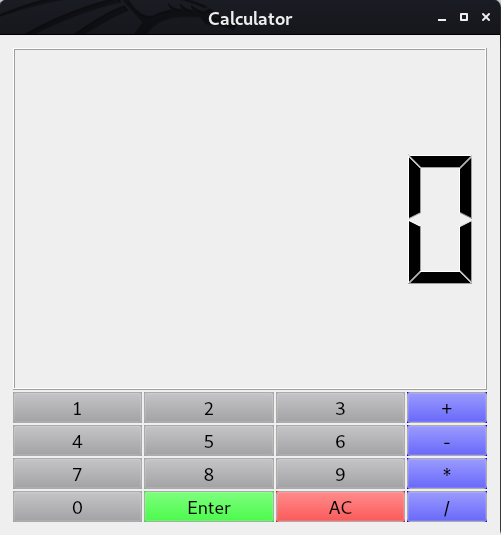
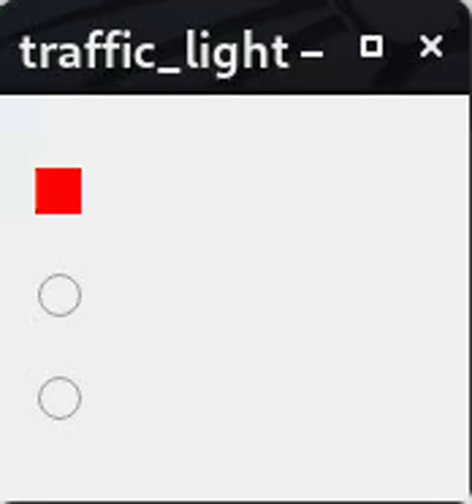

<div id="top"></div>


<!-- PROJECT LOGO -->
<br />
<div align="center">
    
  <h2 align="center">Signal and Slots</h2>
  <h3 align="center">Implements your first Gui Interactive Widget</h3>
</div>


<!-- TABLE OF CONTENTS -->
<details>
  <summary>Table of Contents</summary>
  <ol>
      <li>
         <a href="#about-the-project">About The Project</a>
         <ul>
            <li><a href="#getting-started">getting started</a></li>
         </ul>
      </li>
        <li><a href="#Calculator">Calculator</a>
            <ul>            
               <li><a href="#Interactions">Interaction</a></li>
                    <ul>
                       <li><a href="#Connections">Connections</a></li>
                       <li><a href="#Integers-Interaction">Integers-Interaction</a></li>
                       <li><a href="#Operation-Interaction">Operation-Interaction</a></li>
                   </ul>  
               <li><a href="#Enter-Button">Enter Button</a></li>
               <li><a href="#Enhancements">Enhancements</a></li>
            </ul>
          </li>
        <li><a href="#Traffic-Light">Traffic Light</a></li> 
        <li><a href="#Digital-clock">Digital clock</a></li> 
  </ol>
</details>


<!-- ABOUT THE PROJECT -->
# About The Project

<!-- GETTING STARTED -->
## Getting Started

This is an example of how you may give instructions on setting up your project locally.
To get a local copy up and running follow these simple example steps.

1. [**How to install Qt**](https://anassbelcaid.github.io/CS221/qtcreator/)
2. **Clone the repo**
   ```sh
   git clone https://github.com/IlyasKadi/Signal-and-Slots.git
   ```

<p align="right">(<a href="#top">back to top</a>)</p>

<!-- Calculator -->
# Calculator

This exercise follows up to add **interactive** functionality to the **calculator** widgets written in the previous homework. The goal is to use [Signals and Slots](https://doc.qt.io/qt-5/signalsandslots.html) to simulate a basic calculator behavior. The supported operations are`*, +, -, /`.

<p align="center">
     
   </p> 
  
  >  Calculator 
  

 .Header
```cpp
class Calculator : public QWidget
{
    Q_OBJECT
public:
    Calculator(QWidget *parent = nullptr);
    ~Calculator();
 // Add you custom slots here
protected:
    void createWidgets();        //Function to create the widgets
    void placeWidget();         // Function to place the widgets
    void makeConnexions();      // Create all the connectivity
//events
protected:
    void keyPressEvent(QKeyEvent *e)override;     //Override the keypress events

private:
    double * left= new double{0};          //left operand
    double * right=nullptr;         // right operand
    QString *operation=nullptr;  // Pointer on the current operation

public slots:
   void newDigit();
   void changeOperation();
   void showresults();
   void resetall();

private:
    QGridLayout *buttonsLayout; // layout for the buttons
    QVBoxLayout *layout;        //main layout for the button
    QVector<QPushButton*> digits;  //Vector for the digits
    QPushButton *enter;            // enter button
    QPushButton *reset;            // reset button
    QVector<QPushButton*> operations; //operation buttons
    QLCDNumber *disp;             // Where to display the numbers

};
```
   > NOTE: We initialize left by 0 so if you perform an operation before adding the left, it will be assigined by default (0).

<p align="right">(<a href="#top">back to top</a>)</p>


<!-- Digits-Interaction -->
## Interactions

### Connections
  1. We will add the connections of  the digits, operatoins, enter_buttons, and the reset_button.
   
```cpp
void Calculator::makeConnexions()
{
     //Connecting the digits
     for(int i=0; i <10; i++)
         connect(digits[i], &QPushButton::clicked,
                 this, &Calculator::newDigit);

     //Connecting the operations
     for(int i=0; i <4; i++)
         connect(operations[i], &QPushButton::clicked,
                 this, &Calculator::changeOperation);

     //Connecting the enter_button
     connect(enter, &QPushButton::clicked,
             this, &Calculator::showresults);

     //Connecting the reset_button
     connect(reset, &QPushButton::clicked,
             this, &Calculator::resetall);
}
```
### Integers-Interaction 

   2. Now, we will implement the newDigit slot to show the digit in the LCDNumber.
    
   We should clarify two points to clearly understand the implementation:
   
  - Which number, should be constructing `left` or `right`

      > The response to this question is easy, If we have an operation, then we already have our **left operand** and we should focus on the right.

   - How to add digit to an existing number.

      > Suppose we are working on left = 43. What should happen if we clicked the digit 2. Simply we should move all digit by one digit **(x10)** and then **add** the **2**. Programmatically speeaking this could done by :

      `*left = (*left) * 10 + digit`


```cpp
void Calculator::newDigit( )
{
    //getting the sender
    auto button = dynamic_cast<QPushButton*>(sender());

    //getting the value
    int value = button->text().toInt();

    //Check if we have an operation defined
    if(operation)
    {
        //check if we have a value or not
        if(!right)
            right = new int{value};
        else
            *right = 10 * (*right) + value;

        disp->display(*right);

    }
    else
    {
        if(!left)
            left = new int{value};
        else
            *left = 10 * (*left) + value;

        disp->display(*left);
    }
}
```

<p align="right">(<a href="#top">back to top</a>)</p>


### Operation-Interaction

Now we will move on the `operation` of the four buttons. We will the same mechanism using the `sender` method. Hence we will define a single slot to handle the click on the operations buttons:

```cpp
public slots:
    void changeOperation();  //Slot to handle the click on operations
    void newDigit();
```
This slot will simply execute the following operations:

   - Get the identity of the sender button.
   - Store the clicked operation.
   - Reset the display to 0

```cpp
void Calculator::changeOperation()
{
    //Getting the sender button
    auto button = dynamic_cast<QPushButton*>(sender());

    //Storing the operation
    operation = new QString{button->text()};

    //Initiating the right button
    right = new int{0};

    //reseting the display
    disp->display(0);
}
```


<p align="right">(<a href="#top">back to top</a>)</p>


<!-- Enter-Button -->
## Enter-Button

1. We named the function for enter button  `showresults()`, where all the four operations are made 
> NOTE: for the division if you divid any number by 0 it will gives an ERROR (Err) in the LCDnumber.

```cpp
void Calculator::showresults()
{
    //getting the sender
    auto button = dynamic_cast<QPushButton*>(sender());

    //getting the value
    enter = new QPushButton{button};

     if(operation== QString{"+"})
    {
        disp->display(*left + *right);
        *left=*left + *right;
        *right=0;

    }
    else if(operation== QString{"-"})
    {
        disp->display(*left - *right);
        *left=*left - *right;
         *right=0;
    }
    else if(operation== QString{"/"})
    {
         if(*right==0)
         {
             disp->display("err");
         }
         else
         {
             disp->display(*left / *right);
             *left=*left / *right;
              *right=0;
         }
    }
    else if(operation== QString{"*"})
    {
        disp->display(*left * *right);
        *left=*left * *right;
         *right=0;
    }
}
```

<p align="right">(<a href="#top">back to top</a>)</p>


<!-- Enhancements -->
## Enhancements

  We named the function for AC button  `resetall()`, where we reset the pointers right  and operation to `nullptr` and left to 0 and 0 as a display for the LCDnum. 
   - Adding the reset button (C).

```cpp
void Calculator::resetall()
{
    auto button = dynamic_cast<QPushButton*>(sender());

    //getting the value
    reset = new QPushButton{button};

    //resetting the pointers
    *left=0;
    right=nullptr;
    operation=nullptr;

    //display when resetting(0)
    disp->display(0);
}
```

   - Adding the three or more operand such as (24 * 23 + 23)!
   - > NOTE: Each time when you perform an operation left will take the result (as a memory) check out the [`showresults()`](#Enter-Button) function
```cpp
    {
        disp->display(*left (op) *right);
        //left as memo
        *left=*left (op) *right;
        *right=0;

    }
```


<p align="right">(<a href="#top">back to top</a>)</p>


<!-- Traffic Light -->
# Traffic-Light

In this exercise, we will use the [QTimer](https://doc.qt.io/qt-5/qtimer.html) to simulate a **traffic light**.

image
Simulating Traffic Light using Radio Buttons

   1. Download the starter code TrafficLight.zip

   2. Investigate the code in order to underhand each component of the `TrafficLight` class.

   3. let's add some functions in order to : 
   
   a. change `each 3 seconds` in the following order: `Red -> Green -> Yellow`

   b. change to yellow `each 4 seconds`, to green `each 1 seconds`, to red `each 2 seconds`
    
   c. set lights by keyboard.


 .Header
```cpp
class TrafficLight: public QWidget{
  Q_OBJECT

public:

  TrafficLight(QWidget * parent = nullptr);
  void timerEvent(QTimerEvent *e) override;
  void keyPressEvent(QKeyEvent *event) override;

protected:
     void createWidgets();
     void placeWidgets();


private:
  int index=0;
  int times[3]={4,1,2};
  int currentTime;
  QVector<QRadioButton*> lights ;
  QRadioButton * redlight;
  QRadioButton * yellowlight;
  QRadioButton * greenlight;

};

```
a. 
```cpp
void TrafficLight::placeWidgets()
{

  // Placing the widgets
  auto layout = new QVBoxLayout;

  layout->addWidget(redlight);
  layout->addWidget(yellowlight);
  layout->addWidget(greenlight);

  lights.append(redlight);
  lights.append(greenlight);
  lights.append(yellowlight);

  setLayout(layout);
  startTimer(3000);

    index=0;

}
void TrafficLight::timerEvent(QTimerEvent *e)
{
//TURN RED ...   TURN YELLOW ...  TURN GREE ...
    index= (index + 1 )%3;
    lights[index]->toggle();
}
```


b.
```cpp
void TrafficLight::timerEvent(QTimerEvent *e)
{

//TURN RED ....  TURN YELLOW .    TURN GREE ..
    currentTime++;

    if(redlight->isChecked()&& currentTime==4)
    {
        yellowlight->toggle();
        currentTime=0;
    }
    if(yellowlight->isChecked()&& currentTime==1)
    {
        greenlight->toggle();
        currentTime=0;
    }
    if(greenlight->isChecked()&& currentTime==2)
    {
        redlight->toggle();
        currentTime=0;
    }


}
```
c.

```cpp
void TrafficLight::keyPressEvent(QKeyEvent *event)
{

// PRESS R for (red)

    if(event->key()==Qt::Key_R)
    {
        index=0;
        redlight->toggle();
    }


//PRESS Y for (yellow)

    if(event->key()==Qt::Key_Y)
     {
            index=1;
            yellowlight->toggle();
     }


//PRESS G for (green)
     if(event->key()==Qt::Key_G)
     {
         index=1;
         greenlight->toggle();
     }
}
```

# Digital-clock

.Header
```cpp
class Digitalclock : public QWidget
{
    Q_OBJECT
public:
    explicit Digitalclock(QWidget *parent = nullptr);
    void timerEvent(QTimerEvent*e) override ;
    
protected:
    void createwidgets();
    void placewidgets();
    
private:
    QLCDNumber *hour;
    QLCDNumber *minutes;
    QLCDNumber *seconds;
    QHBoxLayout *digiclock;
};
```
.cpp

```cpp
Digitalclock::Digitalclock(QWidget *parent) : QWidget(parent)
{
     createwidgets();
     placewidgets();
     setWindowTitle("Digital clock");
     startTimer(1000);
}
void Digitalclock:: createwidgets()
{
    hour    = new QLCDNumber;
    minutes = new QLCDNumber;
    seconds = new QLCDNumber;
    digiclock = new QHBoxLayout;
}
void Digitalclock ::placewidgets()
{
    setLayout(digiclock);
    digiclock->addWidget(hour);
    digiclock->addWidget(minutes);
    digiclock->addWidget(seconds);
}
void Digitalclock::timerEvent(QTimerEvent *e)
{
    auto T = QTime::currentTime();
    hour->display(T.hour());
    minutes->display(T.minute());
    seconds->display(T.second());
}
```


<p align="right">(<a href="#top">back to top</a>)</p>


Our Team - [AIT EL KADI Ilyas](https://github.com/IlyasKadi) - [AZIZ Oussama](https://github.com/ATAMAN0)

Project Link: [Signal-and-Slots](https://github.com/IlyasKadi/Signal-and-Slots)

Encadré par : [Mr.BELCAID-Anass](https://anassbelcaid.github.io)

<p align="right">(<a href="#top">back to top</a>)</p>
